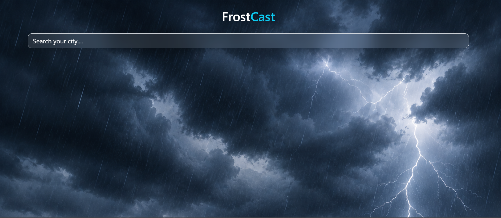
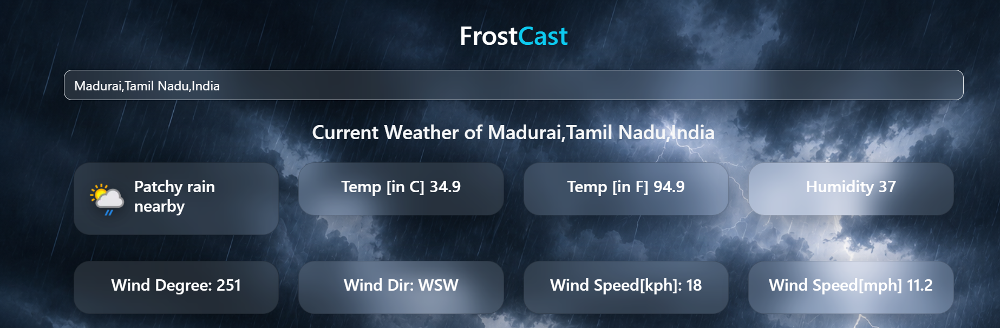
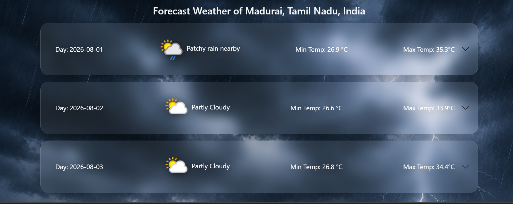

# 🌦️ FrostCast Weather App

## About Project:

FrostCast is a responsive weather application built using React.js that provides real-time weather information for searched locations. It integrates weather APIs to display current weather conditions, temperature, humidity, wind speed, and hourly forecasts.

The project focuses on implementing frontend development concepts including API integration, React state management, responsive UI design, and dynamic data visualization.

## Screenshots

### Weather Search Page

### Weather Current Dashboard

### Weather ForeCast Dashboard

## Installation and Setup:

### Clone Repository:

git clone https://github.com/Vaishu-Nagarajan-09/FrostCast-Weather-App.git

### Install Dependencies:

- cd weatherapp

- npm install

### Run the Project:

- npm run dev

## Tech Stack:
### Frontend
- React.js
- JavaScript
- HTML5
- CSS3
- Bootstrap

### API
- Weather API Integration

### Tools
- Git
- GitHub
- VS Code

## Features:
- Search weather by city
- Current temperature, humidity, and wind speed
- 24-hour weather forecast
- Responsive user interface
- API integration with Axios

## Live Demo:
https://frostcast-weather.netlify.app/

## Author:
Vaishnavi N N
